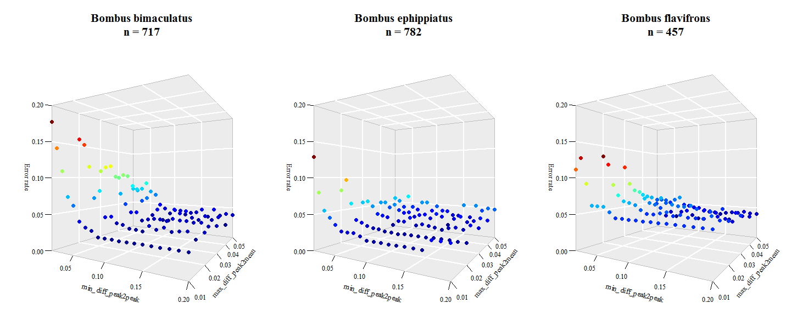
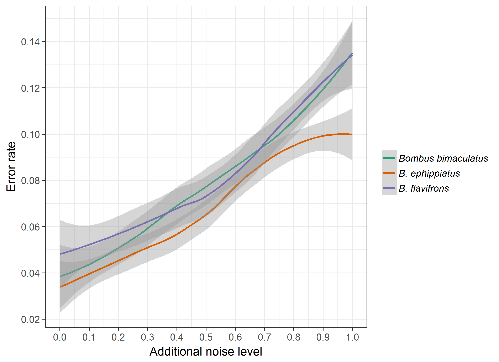

```{r, echo = FALSE}
library(knitr)
knitr::opts_chunk$set(cache = FALSE, fig.width = 7, fig.height = 7,tidy = TRUE,highlight = TRUE,comment = "#>",strip.white = TRUE,collapse = TRUE,tidy = TRUE)
options(width = 55)
```

This document provides all the code that was used for simulations on both, the fur seal data and the three bumblebee datasets. The simulations require many alignments using function `align_chromatograms` and are for this reason computational demanding. The execution of all steps runs for several hours on a standard computer.

## Prerequisites
Most functions that are used in this analysis are part of our package `GCalignR`, while some more functions are provided in form of `R` scripts that are available along with this document in the subdirectory `R`. In order to run the code you need to have a subdirectory called `data` that contains the raw datafiles.

* Install `ggplot2`, `plot3D` and `devtools` if these packages are not available

```{r,eval=FALSE}
## install ggplot2
if (!"ggplot2" %in% rownames(install.packages())) {
    install.packages("ggplot2")
}
## install plot3D
if (!"plot3D" %in% rownames(installed.packages())) {
    install.packages("plot3D")
}
## install devtools
if (!("devtools" %in% rownames(installed.packages()))) { 
    install.packages("devtools")
    } else if (packageVersion("devtools") < 1.6) {
    install.packages("devtools")
    }
```

* Installing the most recent version of `GCalignR` from GitHub

```{r,eval=FALSE}
## install GCalignR
devtools::install_github("mastoffel/GCalignR")
```

* Load packages and source custom function that are provided as a supplement
```{r,results='hide'}
library(GCalignR)
library(ggplot2)
library(plot3D)
## small function to test parameters in align_chromatograms 
source("R/optimal_params.R")
## calculates errors by matching aligned data to a table of known substances
source("R/error_rate.R")
## custom function for simulations based on chromatograms
source("R/ChromaSimFunctions.R")
```

## Explore the parameter space in `align_chromatograms`
There are two parameters of major importance, namely `max_diff_peak2mean` and `min_diff_peak2peak`. While the first determines the finescale grouping of retention times the latter greatly influences the formation of substances by combining initially separated rows of similar retention times. Here, we evaluate the error rate as a function of the combination of these two parameters. The combinations are tested by iteratively running `aling_chromatograms` with the following one hundred combinations

```{r,eval=FALSE}
## run to obtain a table of all combinations
max_diff_peak2mean = seq(0.01, 0.05, 0.01)
min_diff_peak2peak = seq(0.01, 0.2, 0.01)
expand.grid(peak2mean = max_diff_peak2mean,peak2peak = min_diff_peak2peak)
```

* Run alignments with all combinations of both parameters

```{r}
## B. flavifrons
results_bfla <- optimal_params(data = "data/bfla.txt", rt_col_name = "RT", max_diff_peak2mean = seq(from = 0.01, to = 0.05,by = 0.01), min_diff_peak2peak = seq(from = 0.01, to = 0.2, by = 0.01))
save(results_bfla,file = "data/results_bfla.RData")

## B. bimaculatus
results_bbim <- optimal_params(data = "data/bbim.txt", rt_col_name = "RT", max_diff_peak2mean = seq(from = 0.01, to = 0.05,by = 0.01), min_diff_peak2peak = seq(from = 0.01, to = 0.2, by = 0.01))
save(results_bbim,file = "data/results_bbim.RData")

## B. ephippiatus
results_beph <- optimal_params(data = "data/beph.txt", rt_col_name ="RT", max_diff_peak2mean = seq(from = 0.01, to = 0.05,by = 0.01), min_diff_peak2peak = seq(from = 0.01, to = 0.2, by = 0.01))
save(results_beph,file = "data/results_beph.RData")
```

```{r,eval=TRUE}
## Load data
load("data/results_bbim.RData")
load("data/results_beph.RData")
load("data/results_bfla.RData")
```

* Estimate error rates

Error rate calculations are executed with a custom function `error_rate` that uses a list of annotated substances as a reference. See the code for details. 

```{r,eval=TRUE}
errors_bbim <- data.frame(p2p = results_bbim[[2]][["p2p"]], p2m = results_bbim[[2]][["p2m"]])

errors_bbim[["error"]] <- unlist(lapply(X = results_bbim[[1]], error_rate,"data/bbim_ms.txt"))

errors_beph <- data.frame(p2p = results_beph[[2]][["p2p"]], p2m = results_beph[[2]][["p2m"]])

errors_beph[["error"]] <- unlist(lapply(X = results_beph[[1]], error_rate,"data/beph_ms.txt"))

errors_bfla <- data.frame(p2p = results_bfla[[2]][["p2p"]], p2m = results_bfla[[2]][["p2m"]])

errors_bfla[["error"]] <- unlist(lapply(X = results_bfla[[1]], error_rate,"data/bfla_ms.txt"))
```

* Plot results using package `plot3D`

```{r,eval=FALSE}
## Set up the margins 
par(mfrow = c(1,3),family = "serif", mai = c(0.1,0.3,0.5,0.15))
## plotting
with(errors_bbim,scatter3D(
x = p2p,
y = p2m,
z = error, 
pch = 19,
size = 2,
theta = 30,
phi = 0,
ticktype = "detailed",
main = "Bombus bimaculatus\nn = 717",
xlab = "min_diff_peak2peak",
ylab = "max_diff_peak2mean",
zlab = "Error rate",
bty = "g",
colkey = FALSE,
cex = 1.5,
cex.lab = 1.25,
cex.axis = 1.25,
cex.main = 2,
zlim = c(0,0.2)))

with(errors_beph, scatter3D(
x = p2p,
y = p2m,
z = error, 
pch = 19,
size = 2,
theta = 30,
phi = 0,
ticktype = "detailed",
main = "Bombus ephippiatus\nn = 782",
xlab = "min_diff_peak2peak",
ylab = "max_diff_peak2mean",
zlab = "Error rate",
bty = "g",
colkey = FALSE,
cex = 1.5,
cex.lab = 1.25,
cex.axis = 1.25,
cex.main = 2,
zlim = c(0,0.2)))

with(errors_bfla, scatter3D(
x = p2p ,
y = p2m,
z = error, 
pch = 19,
size = 2,
theta = 30,
phi = 0,
ticktype = "detailed",
main = "Bombus flavifrons\nn = 457",
xlab = "min_diff_peak2peak",
ylab = "max_diff_peak2mean",
zlab = "Error rate",
bty = "g",
colkey = FALSE,
cex = 1.5,
cex.lab = 1.25,
cex.axis = 1.25,
cex.main = 2,
zlim = c(0,0.2))) 
```

```{r,out.width = "525px", fig.retina=NULL, echo=FALSE, fig.align='center', fig.cap="Influence of paramter combinations on the error rate of alignments. Sample size refer to the number of retention times considered."}
 
```

The exploration of the parameter space shows that the parameter `min_diff_peak2peak` has the greatest potential to change the error rate and thereby the accuracy of an alignment. Using small values allows a fine scalled grouping of retention times by penalising deviations strongly, but seems not appropriate for the three datasets. Allowing larger differences between unique peaks favours the correct assignment of more variable substances. 

## Simulate the effect of additional noise
The performance of GCalignR is clearly dependend on the quality of the raw data. To show the effect of noise (i.e. bad quality chromatograms) we used again the raw datasets of [@Dellicour.2013] and added small errors to a varying proportion of peaks and repeated the error calculation as shown above. This time we choose default values for `min__diff_peak2peak`and `max_diff_peak2mean`that were shown to be robust. 

* Aligning the raw datasets with default settings

```{r,eval=FALSE}
## we align that untreated datasets in order to extract input retention times
bbim_zero <- align_chromatograms(data = "data/bbim.txt",rt_col_name = "RT")
save(bbim_zero,file = "data/bbim_zero.RData")
beph_zero <- align_chromatograms(data = "data/beph.txt",rt_col_name = "RT")
save(beph_zero,file = "data/beph_zero.RData")
bfla_zero <- align_chromatograms(data = "data/bfla.txt",rt_col_name = "RT")
save(bfla_zero,file = "data/bfla_zero.RData")
```
```{r,eval=FALSE}
load("data/bbim_zero.RData")
load("data/beph_zero.RData")
load("data/bfla_zero.RData")
```

* Convert to lists

```{r}
bfla_chroma <- lapply(bfla_zero[["input_list"]],na.remove) # remove NAs
bbim_chroma <- lapply(bbim_zero[["input_list"]],na.remove) # remove NAs
beph_chroma <- lapply(beph_zero[["input_list"]],na.remove) # remove NAs
```

* Do the simulations

* Dataset *Bombus flavifrons*

```{r,results='hide'}
bfla_out <- sim_linear_shift(bfla_chroma,
                             rt_col_name = "RT",shifts = c(-0.03,0.03))
bfla_shifted <- bfla_out[["Chromas"]] 

p <- rep(seq(from = 0,to = 1,by = 0.05),each = 8)
bfla_data <- list()
names <- character()
for (i in 1:length(p)) { 
## add errors
temp <- lapply(bfla_shifted,add_peak_error,p = p[i],
               rt_col_name = "RT",conc_col_name = "Area",
               distr = c(-0.02,-0.01,0.01,0.02)) 
## extract peak list
temp <- lapply(temp, FUN = function(x) x[["chroma"]])
aligned <- align_chromatograms(temp,rt_col_name = "RT",max_linear_shift = 0.05)     
## We need the "true" retention times for referencing purposes
aligned <- original_rt(org = bfla_chroma,aligned = aligned,rt_col_name = "RT")
bfla_data <- append(bfla_data,list(aligned))
names <- c(names,paste0("no_",as.character(i),"_noise_",as.character(p[i])))
}
names(bfla_data) <- names
bfla_simulations <- list(OptAlign = bfla_zero,SimAlign = bfla_data,noise = p) 
save(x = bfla_simulations,file = paste0("data/","bfla_simulations",".RData"))   
```

* Dataset *Bombus bimaculatus*

```{r,results='hide'}
bbim_out <- sim_linear_shift(bbim_chroma,
                             rt_col_name = "RT",shifts = c(-0.03,0.03))
bbim_shifted <- bbim_out[["Chromas"]] # linearly shifted sample

p <- rep(seq(from = 0,to = 1,by = 0.05),each = 8)
bbim_data <- list()
names <- character()
for (i in 1:length(p)) { 
## add errors
temp <- lapply(bbim_shifted,add_peak_error,p = p[i],
               rt_col_name = "RT",conc_col_name = "Area",
               distr = c(-0.02,-0.01,0.01,0.02)) 
## extract peak list
temp <- lapply(temp, FUN = function(x) x[["chroma"]])
aligned <- align_chromatograms(temp,
                               rt_col_name = "RT",max_linear_shift = 0.05)
## We need the "true" retention times for referencing purposes
aligned <- original_rt(org = bbim_chroma,aligned = aligned,rt_col_name = "RT")
bbim_data <- append(bbim_data,list(aligned))
names <- c(names,paste0("no_",as.character(i),"_noise_",as.character(p[i])))
}
names(bbim_data) <- names
bbim_simulations <- list(OptAlign = bbim_zero,SimAlign = bbim_data,noise = p) 
save(x = bbim_simulations,file = paste0("data/","bbim_simulations",".RData"))   
```

* Dataset *Bombus ephippiatus*

```{r,results='hide'}
beph_out <- sim_linear_shift(beph_chroma,
                             rt_col_name = "RT",shifts = c(-0.03,0.03))
beph_shifted <- beph_out[["Chromas"]] # linearly shifted sample

p <- rep(seq(from = 0,to = 1,by = 0.05),each = 8)
beph_data <- list()
names <- character()
for (i in 1:length(p)) { 
## add errors
temp <- lapply(beph_shifted,add_peak_error,p = p[i],
               rt_col_name = "RT",conc_col_name = "Area",distr = c(-0.02,-0.01,0.01,0.02)) 
## extract peak list
temp <- lapply(temp, FUN = function(x) x[["chroma"]])
aligned <- align_chromatograms(temp,rt_col_name = "RT", max_linear_shift = 0.05)    
## We need the "true" retention times for referencing purposes
aligned <- original_rt(org = beph_chroma,aligned = aligned,rt_col_name = "RT")
beph_data <- append(beph_data,list(aligned))
names <- c(names,paste0("no_",as.character(i),"_noise_",as.character(p[i])))
}
names(beph_data) <- names
beph_simulations <- list(OptAlign = beph_zero,SimAlign = beph_data,noise = p) 
save(x = beph_simulations,file = paste0("data/","beph_simulations",".RData"))   
```

* Estimate errors
```{r, eval=TRUE}
load("data/bfla_simulations.RData")
load("data/beph_simulations.RData")
load("data/bbim_simulations.RData")
## set up data frames
bfla <- data.frame(data.frame(noise = bfla_simulations[["noise"]]))
bbim <- data.frame(data.frame(noise = bbim_simulations[["noise"]]))
beph <- data.frame(data.frame(noise = beph_simulations[["noise"]]))
## calculate errors
bfla[["error"]] <- unlist(lapply(X = bfla_simulations[["SimAlign"]],
                                 error_rate, Reference = "data/bfla_ms.txt",
                                 rt_col_name = "RT", linshift = FALSE))
bbim[["error"]] <- unlist(lapply(X = bbim_simulations[["SimAlign"]],
                                 error_rate, Reference = "data/bbim_ms.txt",
                                 rt_col_name = "RT", linshift = FALSE))
beph[["error"]] <- unlist(lapply(X = beph_simulations[["SimAlign"]],
                                 error_rate, Reference = "data/beph_ms.txt",
                                 rt_col_name = "RT",linshift = FALSE))
## Combine data into one data frame
df <- rbind(bbim,bfla,beph)
df[["id"]] <- rep(c("bbim","bfla","beph"),each = nrow(df)/3)
save(df,file = "data/df.RData")
```

* Plotting results

```{r, message=FALSE}
load("data/df.RData")
plot <- ggplot2::ggplot(data = df,aes(x = noise, y = error, group = id, col = id, fill = id)) + 
    geom_smooth(level = 0.95, size = 1.5, alpha = 0.2) + 
    theme_bw(base_size = 14, base_family = "sans") + 
    theme(panel.grid.major = element_blank(),
          panel.grid.minor = element_blank(),
          aspect.ratio = 1,
          legend.justification = c(0,0),
          legend.position = c(0.7,0.02),
          legend.background = element_rect(color = "black",fill = NA)) +
    xlab("Additional noise level") +
    ylab("Error rate") +
    scale_x_continuous(breaks = seq(0,1,0.1), expand = c(0,0)) +
    scale_y_continuous(breaks = seq(0,0.3,0.02), expand = c(0,0)) +
    scale_colour_manual(values = c("#1B9E77", "#D95F02", "#7570B3"),
                        name = "Bumblebee datasets",
                        breaks = c("bbim", "beph", "bfla"),
                        labels = c("Bombus bimaculatus",
                                   "B. ephippiatus",
                                   "B. flavifrons"),
                        guide = guide_legend(
                            label.theme = element_text(
                                face = "italic", angle = 0,
                                size = 12))) +
    
    scale_fill_manual(values = c("#1B9E77", "#D95F02", "#7570B3"),
                        name = "Bumblebee datasets",
                        breaks = c("bbim", "beph", "bfla"),
                        labels = c("Bombus bimaculatus",
                                   "B. ephippiatus",
                                   "B. flavifrons"),
                        guide = guide_legend(
                            label.theme = element_text(
                                face = "italic", angle = 0,
                                size = 12)))
```

```{r,echo=FALSE,results="hide",eval=FALSE,message=FALSE}
ggsave(plot,filename = "figures/noise_simulation.tif",device = "tiff",dpi = 300,width = 8,height = 8,units = "in")
```

```{r,out.width = "500px", fig.retina=NULL, fig.align='center',echo=FALSE, fig.cap="Influence of additional noise levels on the error rate of alignments. Shaded areas around the lines indicate confidence intervals at a level of 0.95"}

```
\newpage
## References 